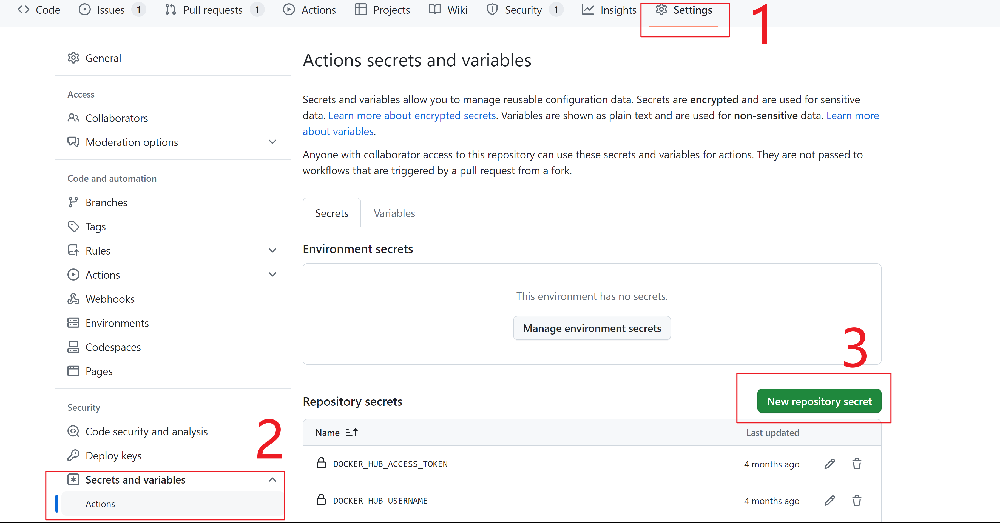

## 使用方法一：油猴脚本

油猴脚本代码在 index_passage_list 中
油猴：https://greasyfork.org/en/scripts/489464-auto-read

## 使用方法二：puppeteer 无头运行

### 1.设置环境变量

.env 里面设置用户名 密码

### 2.运行

#### Windows

```sh
npm install
node .\pteer.js
```

#### Linux 额外安装以下包，运行命令相同

```sh
sudo apt-get update
sudo apt install nodejs npm  -y
sudo apt-get install -y wget unzip fontconfig locales gconf-service libasound2 libatk1.0-0 libc6 libcairo2 libcups2 libdbus-1-3 libexpat1 libfontconfig1 libgcc1 libgconf-2-4 libgdk-pixbuf2.0-0 libglib2.0-0 libgtk-3-0 libnspr4 libpango-1.0-0 libpangocairo-1.0-0 libstdc++6 libx11-6 libx11-xcb1 libxcb1 libxcomposite1 libxcursor1 libxdamage1 libxext6 libxfixes3 libxi6 libxrandr2 libxrender1 libxss1 libxtst6 ca-certificates fonts-liberation libappindicator1 libnss3 lsb-release xdg-utils wget

```

## 使用方法三：GitHub Action 每天 0 点阅读

(可自行修改启动时间和持续时间，代码.github\workflows\cron_read.yaml)

### 1. fork 仓库

### 2.设置环境变量

在 GitHub action 的 secrets 设置用户名密码（变量名参考.env 中给出的）（.env 里面设置用户名密码在这里无效）


### 3.启动 workflow

教程：https://github.com/ChatGPTNextWeb/ChatGPT-Next-Web?tab=readme-ov-file#enable-automatic-updates

## 使用方法四：docker 运行

### 1.立刻执行

克隆仓库，在`docker-compose.yml`里面设置环境变量，然后运行

```sh
 docker-compose up -d
```

查看日志

```sh
docker-compose logs -f
```

### 2.定时运行

```sh
chmod +x cron.sh

crontab -e
```

手动添加以下内容(功能是每天六点执行)

```sh
0 6 * * *  /root/auto-read-liunxdo/cron.sh  # 注意这是示例目录，要改为所在仓库目录的cron.sh（使用pwd查看所在目录）
```

# 如何增加基于discourse的其它网站的支持？
1. 修改 index_passage_list 中的// @match ，根据其它示例网站，填写新的url，此外在脚本开头的possibleBaseURLs中也添加url
2. 服务器运行时，还需要修改.env下的WEBSITE变量为对应的网址（如果网址是不存在原先脚本的，需要修改external.js中对应的部分，重新构建镜像）
#### 其它

external是作为puppeteer的脚本使用的，由index_passage_list.js改造，主要是去除了按钮以及设置为自动阅读和自动点赞启动
```sh
   localStorage.setItem("read", "true"); // 开始时自动滚动关闭
    localStorage.setItem("autoLikeEnabled", "true"); //默认关闭自动点赞

      // document.body.appendChild(button);
  // document.body.appendChild(toggleAutoLikeButton);
```